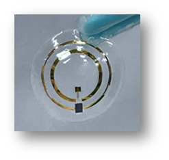
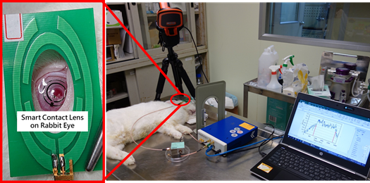

## 1. 高靈敏度二氧化錫氣體感測器

本實驗室利用二氧化錫（SnO2）的各項優點並結合液相沈積薄膜製程方法與微機電技術，製作出具微小化、高辨識性、高靈敏度、非侵入式與反應時間快之氣體感測器。另外，特殊薄膜製程方法具有簡單製程設備、無須在昂貴的真空環境下即可沈積，且可批次量產、大幅降低製程成本。

## 2. 非侵入微晶片式眼壓感測器

本研究為利用微機電製程技術在軟式隱形眼鏡基材上製作一個新式的非侵入微晶片式眼壓感測器。主要的感測原理是由眼壓自然變化造成眼角膜形變，並利用貼服於角膜之感測單元做為感測角膜輪廓的方式而間接得到眼壓的變化，當眼壓導致角膜曲率改變時使得電容值變化，此電容值經由數位電路轉換成數位訊號後，便可由無線射頻系統發送出感測到眼壓的訊號，再由外部讀取單元接收並分析訊號以達成眼壓值測量的目的。

     
     
    圖一 微晶片式隱形眼鏡眼壓感測器 
     
    圖二 動物試驗

## 3. 微探針電極與電路系統
